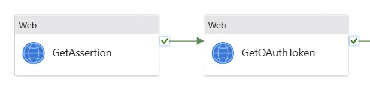

# Extracting data from SAP Success Factors using Azure Data Factory 
In this repository you will find an example of how to extract data from SAP Success Factors using Azure Data Factory.

## Overview
SAP Successfactors has its own oData based API used for data extraction. Please refer to [SAP SuccessFactors API Reference Guide (OData V2)](https://help.sap.com/docs/SAP_SUCCESSFACTORS_PLATFORM/d599f15995d348a1b45ba5603e2aba9b/03e1fc3791684367a6a76a614a2916de.html).

To be able to use the oData API you first need to authenticate using oAuth. This will provide you with an access token which can be passed on to the oData API's which will extract the data.

These are the high level steps which need to be executed :
1. Register your client application in SAP SuccessFactors to obtain an API key.
2. Obtain a SAML assertion 
3. Generate an oAuth token.
4. Use the generated token to call oData APIs to extract data

In Azure Date Factory the overall pipeline looks as follows :


The `GetAssertion` and `GetOAuthToken` activities are used to authenticate against SAP SuccessFactors. The actual extraction is done in the `Copy Data` steps. Since we want to extract multiple entities, both source and sink datasets and also the mappings towards a SQL database are parameterized. These parameters are retrieved in the 'JsonTransformation' and 'Set filename output' activities.

Since we also want to extract multiple SAP SuccessFactor entities, this parameterid pipeline is capsulated in a `For Each` loop to iterate over the different entities.
The list of entities and mappings is stored in a SQL DB. The content of the DB is retrieved in the `GetTableList` activity which reads out the DB using SQL.


>Note: In this blog we focus on the authentication and data extraction part. Details on how to implement the table, SQL Queries, mappings,  ... are not explained in detail. They are however contained in the included sample pipeline, datasets and sql scripts.

>Note: One might also consider to move to Authentication part out of the `for each` loop.

### Step 1-3 : Authentication

The following figure gives an overview of the authentication flow :


For more information on each individual step, please refer to [SAP Successfactors - Authentication Using OAuth 2.0](https://help.sap.com/docs/SAP_SUCCESSFACTORS_PLATFORM/d599f15995d348a1b45ba5603e2aba9b/d9a9545305004187986c866de2b66987.html)

#### Register your Client Application
In this step you need to register your client application, which is Azure Data Factory, in SAP SuccessFactors. This step is handled within SAP SuccessFactors itself.

This step will result in an `API Key`, `client_id`. You can also associate a user with Azure Data Factory.
For more information, please refer to [SAP Successfactors - Registering your oAuth2 Client Application](https://help.sap.com/docs/SAP_SUCCESSFACTORS_PLATFORM/d599f15995d348a1b45ba5603e2aba9b/6b3c741483de47b290d075d798163bc1.html). 

#### Obtain a SAML assertion
In this step you generate a SAML assertion document, which will be used to request the access token.
You can obtain a SAML assertion either from your trusted IdP (recommended) or using the offline SAML generator provided by SAP SuccessFactors.
For more information see : [SAP SuccessFactors - Generating a SAML Assertion](https://help.sap.com/docs/SAP_SUCCESSFACTORS_PLATFORM/d599f15995d348a1b45ba5603e2aba9b/4e27e8f6ae2748ab9f23228dd6a31b06.html)

> Note : we used the SAP SuccessFactors built-in Identity Provided `/oauth/idp`.
  
The HTTP Request looks as follows :
```
### Get SAML Assertion
# @name getSAMLAssertion
POST https://api012.successfactors.eu/oauth/idp
?client_id={{client_id}}
&user_id={{user_id}}
&token_url={{token_url}}
&private_key={{private_key}}
Content-Type: application/x-www-form-urlencoded
```

>Note: Above sample code can be used in Visual Studio Code using the [REST Client Extension](https://marketplace.visualstudio.com/items?itemName=humao.rest-client). A complete http test script can be found [here](testscript\SuccessFactorsTest.http).  


In Azure Data Factory we can obtain the SAML assertion using a `Web` activity:


##### Get SAML Assertion - Web Activity Settings</b>
* URL : `https://api012.successfactors.eu/oauth/idp` (or other url provided by SAP SuccessFactors)
* Method : `POST`
* Body : `client_id=@{pipeline().parameters.client_id}&user_id=@{pipeline().parameters.user_id}&token_url=@{pipeline().parameters.token_url}&private_key=@{pipeline().parameters.private_key}`
* Header: `Content-type = application/x-www-form-urlencoded`


The parameters are defined at pipeline level.


>Note : some of these parameters are also used to parameterize the sink and source data sets.

#### Generate an oAuth token
The generated SAML Assertion can then be used for oAuth authentication.

You can obtain the oAuth Access token as follows :
```
### Get OAuthToken
# @name getOAuthToken
@assertion = {{getSAMLAssertion.response.body.*}}
POST {{token_url}}
Content-Type: application/x-www-form-urlencoded

company_id={{comany_id}}&client_id={{client_id}}&company_id={{comany_id}}&grant_type=urn:ietf:params:oauth:grant-type:saml2-bearer&assertion={{assertion}}
```

The access token can be found in the response body :

```json
{
  "access_token": "*** your access token ***",
  "token_type": "Bearer",
  "expires_in": 45321
}
```

In ADF this is also modeled as a `Web`Activity, following the `GetAssertion`.



##### Get oAuth Token - Web Activity Settings</b>
* URL : `https://api012.successfactors.eu/oauth/token`
* Method : `POST`
* Body : `@concat('client_id=',pipeline().parameters.client_id,'&company_id=',pipeline().parameters.company_id,'&grant_type=urn:ietf:params:oauth:grant-type:saml2-bearer&assertion=',activity('GetAssertion').output.Response)`

>Note: `activity('GetAssertion')` refers to the previous `GetAssertion`step


### Step 4 : Data Extraction
The access token can then be used as Bearer authentication in the subsequent oData calls to extract data.

#### Sample to extract users :
```
### Get UserSchema
# @name getUserSchema
@access_token = {{getOAuthToken.response.body.access_token}}
GET https://api012.successfactors.eu/odata/v2/Entity('User')?$format=json
Authorization: Bearer {{access_token}}
```

In Azure Data Factory the data extraction is modeled using the `Copy Data` activity :

 

#### Copy Activity - Source Settings
This relates to the SAP SuccessFactors oData API. Since we want to extract multiple SAP SuccessFactor Entities, the source (and also the sink) data set are parameterized. 
* `BaseURL = https://api012.successfactors.eu/` or other relevant API access point provided by SAP
* `RelativeURL = @concat('odata/v2/',dataset().TableName,'?$format=JSON')`. The `dataset().TableName` is the entityset to be extracted, eg. `User`, `EmpJob`, ... . This information is retrieved from a SQL Table.
* `Request Method = Get`
* Additional Headers : here we need to add the `Authorization` header with the `Bearer` access token retrieved from the previous step.

    `Authorization = @concat('Bearer ',activity('GetOauthToken').output.access_token)`

    >Note: The `activity('GetOauthToken')` refers to the previous step.


#### Copy Activity - Sink Settings
* This is the json file to write the data to. The JSON filename was parameterized.


### Extracting Multiple Entities
Since we want to extract multiple SAP SuccessFactors entities, the source and sink datasets were parameterized. These parameters are retrieved at the beginning of the pipeline using a `Lookup` activity. Here a select statement is used to retrieve a table containing the different parameters per entity. This parameter table is then used in a `ForEach` activity to loop over the different entities to be extracted.


>Note: this is just a sample pipeline. Feel free to change and optimize.\
>Hint: In our case the Authorization steps are with the `For-Each` loop, but one might consider to move these steps outside of the loop.

## Example Flow Implementation
To implement the example pipeline, you need to have access to an Azure Data Factory instance and a sql database (e.g. azure sql database).\
It's highly recommended to deploy a new data factory for this example flow.\
You can also use Synapse pipelines, the steps are similar.

### Configuration Steps
1. Connect a freshly deployed Azure Data Factory to a fork of this repo.
Once completed you should be able to see the pipelines, datasets and other necessary objects needed by the example flow.

2. In the repo under the [SQL Setup](\SQL setup) folder, execute the two sql scripts against your sql instance. These scripts will populate some meta data tables and some sample data for the example flow.

## Related Video Materials
This example flow is explained in the following videos:
* Part1: https://youtu.be/lm2kqTaXatI
* Part2: https://youtu.be/Lt1FO8NsUkQ